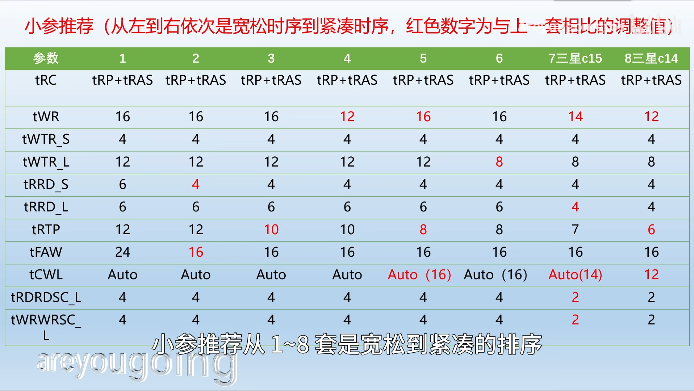

# AMD ZEN3 超频

**参考:[AMD平台终极优化方案](https://www.bilibili.com/video/av1904151444/) 和 [2023年1月AMD内存超频步骤教学 保姆级硬核教学 小白一学包会](https://www.bilibili.com/video/av905669110/)**

## 前期准备

### 软件

- HWINFO(最全的传感器)
- AIDA64(光线追踪64压测,单烤FPU,CPU内存效能测试)
- CPU-Z(CPU相关参数，简易测分)
- Thaiphoon(看内存颗粒参数,不够准)
- Zentimings(看内存参数)
- TestMem5(内存压测)
- [Cinebench R15](https://wwlw.lanzouj.com/iHvrO1ks16tg)(模拟渲染测试)
- [y-cruncher](http://numberworld.org/y-cruncher/#Download)(VT3,FFT)
- P95(历久的CPU压测软件)

> 除Cinebench R15,y-cruncher外，其他都可以在[图吧工具箱](https://www.tbtool.cn/)内找到

## 超频顺序

**内存--->CPU**

## 内存超频

### 首先先明确目标
- 为什么要超频内存,
- 它给我带来的收益是什么,**避免浪费时间**

**清楚需求后**我们可以打开**Thaiphoon软件或拆下内存马甲,查看颗粒料号**

> 这里直接用 Thaiphoon看了
> 依次点开 `EEPROM-READSPD-ON SMBUS #* at*th`

如图

这里 **DIE DENSITY / COUNT下方显示的就是颗粒信息,显示的信息仅供参考,实际请以内存颗粒上的为准**

> 我的是三星D-die,比较垃圾

结合下图确定目标

> 图中详细说明了各个系列CPU的超频上限,内存颗粒上限,以及其他对超频有影响的变量

我的目标的是频率到3600Mhz,主时序尽量低,保证过TM5,Y-cruncher等测试

> Tip:实在觉无聊可以打开PUBG开几把沙漠图ROLL点(跳人多的地方),不闪退报错蓝屏就算过

接下来就是打开AIDA64,找到`内存缓存测试`,双击MEMORY,只测试内存效能

顺便打开Zentimings看看内存参数

两个信息都截个图,作为对比

下面是**参数设置范围**参考

其中**重点需要调整**的有

- **内存频率**
- **FCLK**
- **CMD Rate**
- **GearDownMode**
- **PowerDownMode**
- **DRAM电压**
- **tCL**
- **tRCDRD**
- **tRCDWR**
- **tRP**
- **tRAS**
- **tRC**
- **tRFC**

剩下的就是小参数了

- **tWR**
- tWTR_S
- tWTR_L
- tRRD_S
- tRRD_L
- **tRTP**
- **tFAW**
- **tCWL**
- **tCKE**
- tWRRD
- tRDRDSC_L
- tWRWRSC_L

这里给上**主时序和小参调整**的参考

主时序

小参

测试顺序

